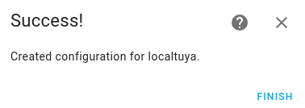
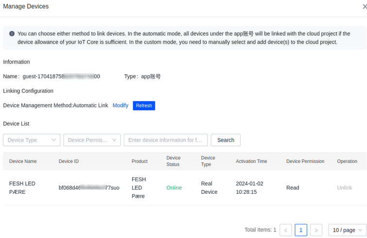
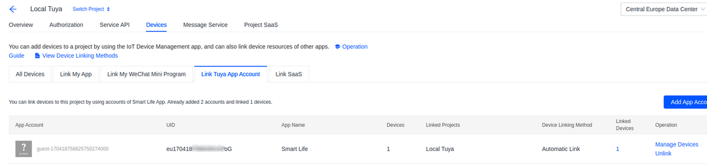
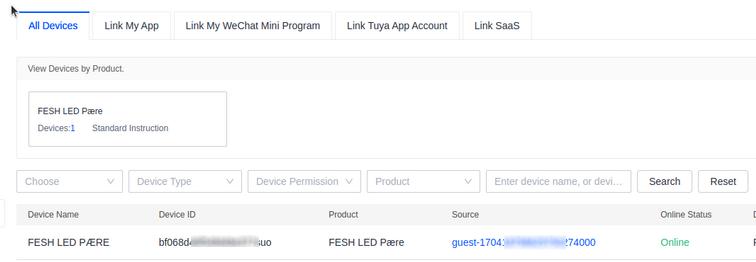

# Local Tuya Installation

[Other guide in english, used as inspiration:](https://smarthomecircle.com/how-to-setup-local-tuya-in-home-assistant)

[If you are using a FESH item:](https://fesh.dk/hjaelpecenter/hvordan-flytter-jeg-min-produkter-til-et-andet-wi-fi-netvaerk/)
The following is shown for a FESH light bulb.

## Move the bulb to your own network

Download the app: **Smart Life**
and connect your bulb in the app - shows the FESH bulb

## Install LocalTuya in Home Assistant

In *Home Assistant*, *HACS* install: **LocalTuya**

- Click on

- Find:  

- Restart *HA*

- In *Settings*, *Installation* click on: 

- Look for LocalTuya:

    

## Settings for LocalTuya

- Start configuration of Local Tuya – remember to mark ”Do not configure …”

  and click on: *Submit*

    
  
  Click on: *Finish*

- Open Local Tuya 

- Click on *Configure* and mark: Add new Device

    
  
  Click on: *Submit*
  Local Tuya will now find the new device with its IP-adress. Click on: *Submit*
  
- Insert a name for the device
    
    
  
  Now we have to find the Local Key.

- Create a Tuya account at:  https://iot.tuya.com/

- After creation of your account click on: *Cloud*, *Development*

    

- Create a Cloud Project, click on:  

- Fill in the the formular, remember *Data Center* and click on: Create

    

- Now a window: *Authorize API services* appears, click on: *Authorize*
- In the windowwith your new project, click on the tab: *Devices*

    

    

- Click on the tab: *Link Tuya Account* and the button: 

  The following window is shown:

  

- Now open the *Smart Life* app. At *Home* choose "+" and *Scan*.
  
  Scan the QR coode.

- At the *Tuya* platform the following window is shown:

  
  
  Click on: *OK*

  
  
  Click on: "X"

- Now your device is shown:

  

  Your app is now linked to the cloud project.

- Click on the tab: *All Devices* and the device is shown.

  

  Copi the *Device ID*.

- Click on:

  

- In the new window choose:

  
  
  and insert the devide-id.

  Click on: 

- In the next window you can see the *Local Key* for the device:

  

  Copy the local_key.

- Back in HA insert the *Local Key*

  

  Click on: *Submit*

- Choose an *Entity Type*

  

  Click on *Submit*

- The enntity has now to be configured depending on the device type. At [GitHub](https://www.markdownguide.org/cheat-sheet/) you can find proprosals for different devices.

  Here the values for a ligt-bulb are used:

  

  You do not need to fill out *Scene*, click on *Submit*. Enter entity-type again, click *Submit*. Now you get:

  

  Click on: *Finish*

- At *Setting*, *Devices* the configured device is now shown.

  

  Open the device and *Device Info* is shown:

  

  Click on the light-bulb and it can now be set up:

  
