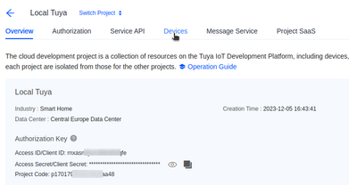

# Local Tuya Installation

[Guide på engelsk:](https://smarthomecircle.com/how-to-setup-local-tuya-in-home-assistant)

[Hvis du har en FESH enhed:](https://fesh.dk/hjaelpecenter/hvordan-flytter-jeg-min-produkter-til-et-andet-wi-fi-netvaerk/)
Jeg har en FESH pære

## Flyt pæren over til eget netværk

Download appen: **Smart Life**
og connect pæren i appen - finder FESH pæren

## Installere LocalTuya i Home Assistant

I Home Assistant i HACS installeres: **LocalTuya**

- Tryk på

- Find:  

- Genstart HA

- I Settings, Installation tryk på: 

- Søg efter LocalTuya:

    

## Opsætning af LocalTuya

- Start configuration af Local Tuya – husk at markere ”Do not configure …”

  og tryk på: Submit

    
  
  Tryg på: Finish

- Åbn Local Tuya 

- Tryk på Configure og marker: Add new Device

    
  
  Tryk på: Submit
- Local Tuya finder den nye device med IP-adresse. Tryk på: Submit
  I skærmbilledet indtastes et navn for Device
    
    
  
  Nu skal  Local Key findes.

- Opret en Tuya account på:  https://iot.tuya.com/

- Efter oprettelse af account tryk på: Cloud, Development

    

- Opret et Cloud Project, tryk på  

- Udfyld formular, husk Data Center og tryk på: Create

    
- Der dukker nu et billede op med: Authorize API services, tryk på: Authorize
- I billedet med det oprettede projekt tryk på Devices:

    

    

- Tryk nu på Link Tuya Account og knappen: 

  Følgende billede vises:

  

- Åbn nu *Smart Life* appen. Under *Home* vælg "+" tegnet og *Scan*
  Scan QR koden

- I *Tuya* platformen vise nu billedet:

  
  Tryk på *OK*

  
  Tryk på "X"

- Nu vises devicen i flg. billede:

  

  Appen er nu linket til cloud projektet.

- Klik på fanen *All Devices* og du kan se din device

  
  Marker *Device ID* og kopier id'en.

- Klik nu på:

  

- I det nye billede vælges:

  
  
  og den kopierede ID indsættes.

  Tryk på: 

- I flg. billede set devicens UUID:

  

  Kopier UUID'en.

